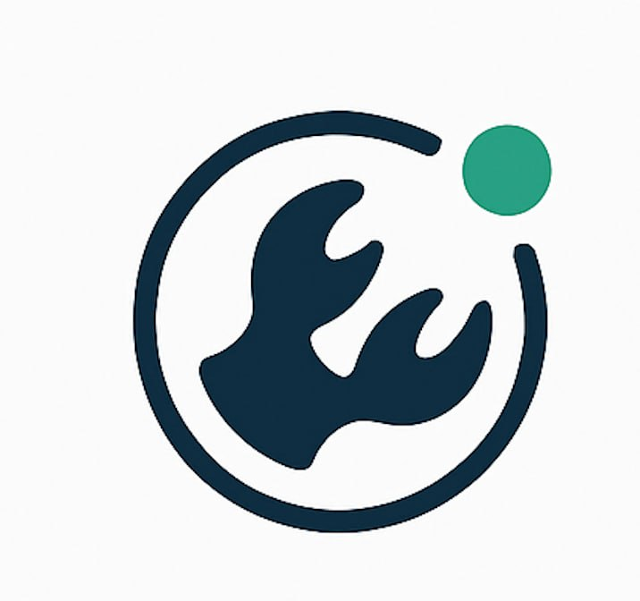
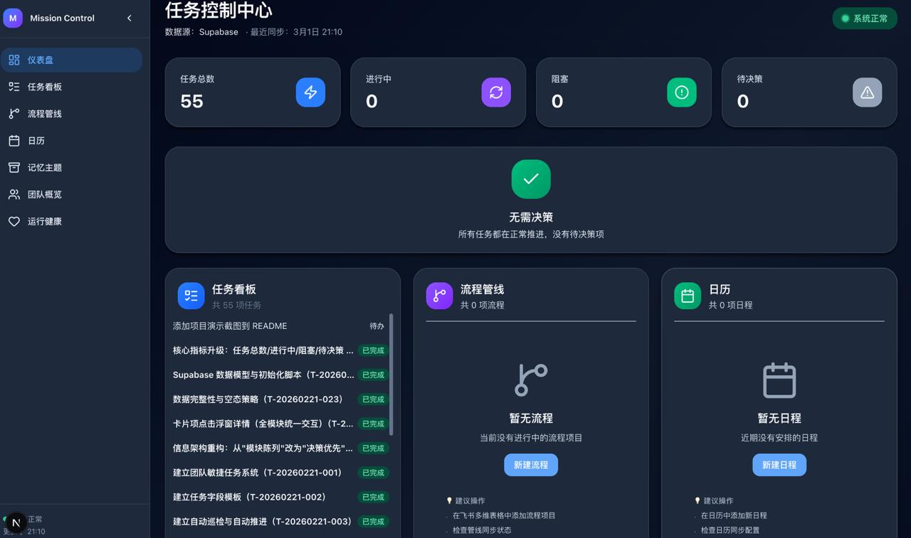
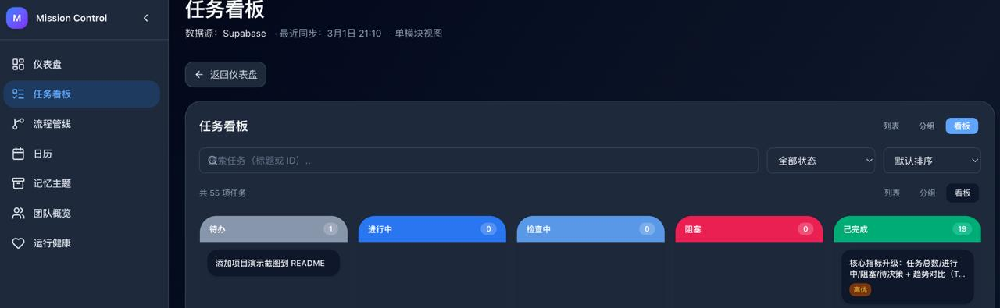
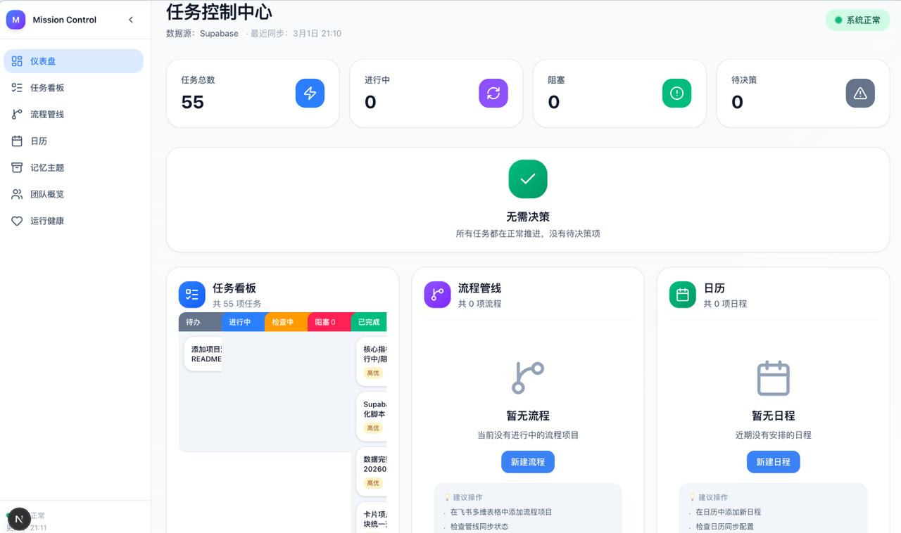

# Mission Claw



> **Mission Claw** 是一款面向 AI Agent 团队的任务管理与自动化巡检系统。通过可视化的任务看板、智能决策中心和定时心跳巡检，帮助 AI 团队高效协作、自动推进阻塞任务。系统支持多视图切换（列表/分组/看板）、拖拽流转、实时数据同步，并与 Supabase 深度集成，实现任务状态的持久化与实时告警。

## 预览

### 仪表盘


### 任务看板


### 看板视图


## 功能

- **任务看板**：可视化任务管理，支持列表/分组/看板视图，拖拽更新状态
- **决策中心**：自动识别阻塞/待决策任务，推进工作流
- **自动巡检**：Cron 定时检查任务状态，自动标记阻塞任务
- **数据可视化**：核心指标趋势对比

## 技术栈

- **前端**：Next.js 16 + React + TypeScript + Tailwind CSS
- **后端**：Next.js API Routes + PostgreSQL (Supabase)
- **实时**：Supabase Realtime

## 快速开始

### 1. 克隆项目

```bash
git clone https://github.com/boboty/mission-control.git
cd mission-control
```

### 2. 安装依赖

```bash
npm install
```

### 3. 配置环境变量

复制 `.env.example` 为 `.env.local`，填入 Supabase 连接信息：

```bash
cp .env.example .env.local
# 编辑 .env.local，填入 DATABASE_URL
```

### 4. 启动开发服务器

```bash
npm run dev
```

访问 http://localhost:3000

## 部署

### Vercel（推荐）

1. Fork 本项目
2. 在 Vercel 导入
3. 添加 `DATABASE_URL` 环境变量
4. Deploy

### 自托管

```bash
npm run build
npm start
```

需要 PostgreSQL 数据库支持。

## 项目结构

```
src/
├── app/              # Next.js App Router
│   ├── api/         # API 路由
│   └── page.tsx     # 主页面
├── components/      # React 组件
│   └── dashboard/   # 看板组件
└── lib/             # 工具函数与类型
```

## License

MIT
