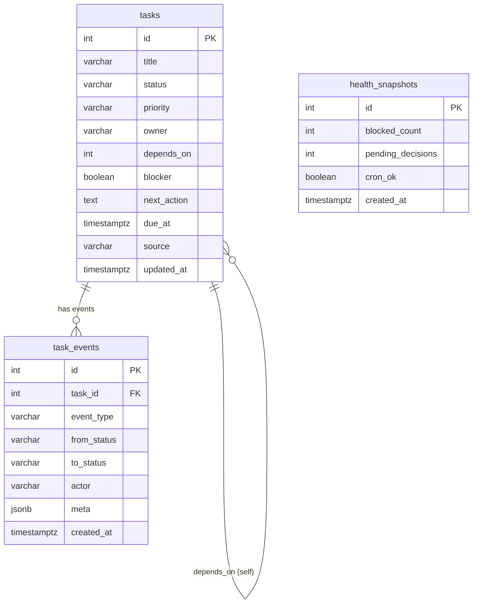

# Mission Control UI 改造方案（V2）

> 目标：在不推翻现有 Next.js/Supabase/PG 架构的前提下，重构 UI 结构与数据流，让“任务巡检 + 运营监控”更清晰、更可扩展。

## 0. 现状速览（基于代码）
- **技术栈**：Next.js（App Router）+ React 19 + TypeScript + Tailwind v4 + DnD-Kit
- **数据访问**：API Route 内用 `pg` 直连 Supabase Postgres（`DATABASE_URL`）
- **模块**：任务看板、流程管线、日历、记忆主题、团队概览、运行健康、决策中心、告警
- **脚本**：
  - `scripts/sync-board-to-supabase.mjs`：从 `board.md` 同步 tasks
  - `scripts/heartbeat_check_tasks.mjs`：心跳巡检并输出告警

---

## 1. 功能模块划分（目标 UI 信息架构）
建议将“仪表盘 + 模块页面”拆成**统一导航 + 模块级页面**，并将“数据质量/告警/决策”独立为固定模块，避免被埋在卡片内。

### 1.1 顶层信息架构
- **Overview**（总览）
  - 关键指标（任务总数、进行中、阻塞、待决）
  - 告警聚合（阻塞>2h、数据落后、失败心跳）
  - 系统健康状态（cron 状态、最近同步）
- **Tasks**（任务工作台）
  - 视图：列表 / 分组 / 看板
  - 过滤：状态、负责人、优先级、时间范围
  - 快速操作：拖拽改状态、标记 blocker、填写 next_action
- **Decisions**（决策中心）
  - 聚焦 blocker / 高优任务
  - 交互：一键“解决/完成”或“升级”为阻塞
- **Pipelines**（流程管线）
  - 进度列表 + 详情
- **Calendar**（日程）
  - 时间维度展示 + 任务到期联动
- **Memory**（记忆/主题）
  - 结构化主题列表 + Markdown 详情
- **Agents**（智能体/成员）
  - 状态与活跃度
- **Health**（运行健康）
  - 最新健康快照 + 历史趋势

### 1.2 页面布局建议
- 左侧导航：固定模块树（可折叠）
- 顶部栏：模块标题 + 数据源/更新时间 + 快捷刷新
- 主区域：模块主视图
- 右侧可选：**详情抽屉**（Task/Decision/Health/Agent 等统一详情样式）

---

## 2. 数据流设计
当前逻辑为“客户端 useEffect -> `/api/*` -> Supabase”。建议分层：

```
UI组件 -> hooks (SWR/React Query) -> API Route -> db/query -> Supabase
```

### 2.1 数据层规范化
新增 `src/lib/db.ts` 统一 PG 连接配置（pool + retry）；新增 `src/lib/queries/*` 封装 SQL。

### 2.2 API 层统一响应格式
所有 `/api/*` 返回统一 envelope：
```ts
{ data, pagination?, meta: { last_sync_at, data_updated_at, source } }
```
便于 UI 统一显示“数据源/更新时间/落后情况”。

### 2.3 客户端数据策略
- 读：`useSWR` 或轻量封装 `useFetch`（避免全页 useEffect）
- 写：PATCH/POST 走 API Route（状态变更、标记阻塞等）
- 刷新策略：
  - 页面加载 -> 拉取
  - 每 60s 轻量刷新 metrics + health（可配置）

---

## 3. 技术选型建议（与现有兼容）
- **继续使用 Tailwind v4 + DnD-Kit**（已有组件）
- 建议引入：
  - `SWR`（轻量数据缓存）或 `@tanstack/react-query`（若需要更复杂缓存）
  - `zod`（API 入参验证）
  - `clsx`（class 合并）
- UI 组件库：
  - 保持现有自研 Card/Metric 等
  - 若需要更标准，可引入 shadcn/ui（但会增加样式维护成本）

---

## 4. 已确认 Supabase 表结构

### 4.1 tasks
| 字段 | 类型 | 默认值 |
|------|------|--------|
| id | integer | auto |
| title | varchar | - |
| status | varchar | 'todo' |
| priority | varchar | 'medium' |
| owner | varchar | - |
| depends_on | integer | - |
| blocker | boolean | false |
| next_action | text | - |
| due_at | timestamptz | - |
| source | varchar | - |
| updated_at | timestamptz | now() |

### 4.2 task_events
- id, task_id, event_type, from_status, to_status, actor, meta(jsonb), created_at

### 4.3 health_snapshots
- id, blocked_count, pending_decisions, cron_ok, created_at

---

## 5. 详细 ERD 图（Mermaid）
> 反映当前已确认字段 + 推断关系（task_events -> tasks）。



### 5.1 关系说明
- **tasks → task_events**：一对多，所有状态变更/阻塞/解除/手工更新记录在 events 中
- **tasks → tasks (self)**：`depends_on` 表示依赖任务（可为空）；可扩展为多对多时再建中间表
- **health_snapshots**：独立快照表，用于展示整体运行健康趋势

---

## 6. API Payload 设计（建议）
> 以现有 `/api/*` 结构为基础，补齐可用的读写接口与 payload 标准。

### 6.1 通用响应结构
```json
{
  "data": {},
  "pagination": {"page": 1, "page_size": 50, "total": 321},
  "meta": {
    "last_sync_at": "2026-03-01T04:00:00Z",
    "data_updated_at": "2026-03-01T04:00:00Z",
    "source": "supabase"
  }
}
```

### 6.2 Tasks

#### GET /api/tasks
**Query**
```
?status=todo,in_progress,blocked
&priority=high,medium
&owner=alice
&source=board
&due_from=2026-03-01
&due_to=2026-03-31
&search=keyword
&page=1&page_size=50
```

**Response (data[])**
```json
{
  "id": 12,
  "title": "Refactor health dashboard",
  "status": "in_progress",
  "priority": "high",
  "owner": "alice",
  "depends_on": 8,
  "blocker": false,
  "next_action": "Implement metrics card",
  "due_at": "2026-03-08T00:00:00Z",
  "source": "board",
  "updated_at": "2026-03-01T03:12:12Z"
}
```

#### GET /api/tasks/:id
**Response (data)**
```json
{
  "task": { ... },
  "events": [ ... ]
}
```

#### PATCH /api/tasks/:id
**Request**
```json
{
  "status": "blocked",
  "priority": "high",
  "owner": "bob",
  "blocker": true,
  "next_action": "Need API contract from backend",
  "due_at": "2026-03-09T00:00:00Z",
  "depends_on": 15
}
```
**Response**
```json
{ "data": {"id": 12, "status": "blocked", ... } }
```
> PATCH 写入同时生成 `task_events`（event_type=update/status_change/blocker_set）

#### POST /api/tasks
**Request**
```json
{
  "title": "New task",
  "status": "todo",
  "priority": "medium",
  "owner": "alice",
  "source": "manual",
  "next_action": "Draft requirements",
  "due_at": "2026-03-10T00:00:00Z"
}
```

---

### 6.3 Task Events

#### GET /api/task-events
**Query**
```
?task_id=12
&event_type=status_change
&page=1&page_size=100
```

**Response (data[])**
```json
{
  "id": 501,
  "task_id": 12,
  "event_type": "status_change",
  "from_status": "todo",
  "to_status": "in_progress",
  "actor": "alice",
  "meta": {"reason": "started"},
  "created_at": "2026-03-01T03:15:00Z"
}
```

#### POST /api/task-events
（保留为系统内部写入，UI 一般不直写）

---

### 6.4 Health Snapshots

#### GET /api/health
**Query**
```
?since=2026-03-01
&limit=50
```

**Response (data[])**
```json
{
  "id": 80,
  "blocked_count": 5,
  "pending_decisions": 2,
  "cron_ok": true,
  "created_at": "2026-03-01T04:00:00Z"
}
```

#### POST /api/health
**Request**
```json
{
  "blocked_count": 3,
  "pending_decisions": 1,
  "cron_ok": true
}
```

---

### 6.5 Overview / Metrics（聚合）
#### GET /api/overview
**Response (data)**
```json
{
  "total": 120,
  "in_progress": 12,
  "blocked": 4,
  "pending_decisions": 3,
  "stale_tasks": 8,
  "last_sync_at": "2026-03-01T04:00:00Z",
  "cron_ok": true
}
```

---

## 7. 实施优先级建议（从低风险到高影响）

### P0（立即可做，低风险）
1. **API 返回统一 envelope**（meta + pagination）
2. **Overview 页新增健康与告警卡片**（基于已有 health_snapshots）
3. **Tasks 过滤条抽象为 FilterBar**（跨视图复用）

### P1（核心体验提升）
1. **Tasks 列表/看板内联编辑**（status / blocker / next_action）
2. **Detail Drawer 抽象组件**（任务/健康/决策统一详情）
3. **Task Events 时间轴展示**（追踪状态变更历史）

### P2（业务扩展 & 可视化增强）
1. **Health 趋势图**（blocked_count / pending_decisions / cron_ok）
2. **Decisions 模块独立页面**（阻塞 & 高优任务聚合）
3. **多来源任务支持**（source 过滤：board / bitable / manual）

### P3（可选增强）
1. **Pipelines & Calendar 深度联动**（任务到期/管线里程碑）
2. **Agents 页面（活跃度 + ownership）**
3. **AI 摘要/优先级建议**（基于 task_events + health_snapshots）

---

## 8. 与现有脚本的集成方式
### 8.1 sync-board-to-supabase
- 作用：从 `board.md` 生成 tasks + health_snapshots
- UI 侧建议：
  - “数据源状态”卡片中展示最后一次 `sync-board` 的时间
  - 对 `source = 'board'` 的任务标记来源徽章

### 8.2 heartbeat_check_tasks
- 输出阻塞/陈旧任务
- UI 侧建议：
  - 将 heartbeat 结果写入 health_snapshots
  - Health 模块展示“最新检测时间 + 关键告警摘要”

### 8.3 未来（Feishu Bitable）
- 统一通过 `source` 字段标识（board / bitable / manual）
- 可在 UI 增加 “来源过滤器”

---

## 9. 关键 UI 改造方向（摘要）
### 9.1 总览页（Overview）
- **上层 KPI**：4 指标 + trend
- **Alert 区**：阻塞 > 2h、数据 stale、cron fail
- **决策中心**：阻塞/高优任务列表（带快速操作）

### 9.2 Tasks 工作台
- 三视图：列表/分组/看板
- 过滤条件统一抽出为 **FilterBar**
- 行内状态改动 + next_action 编辑

### 9.3 Detail Drawer 统一
- 任务/管线/健康/Agent 详情统一 UI 模式
- Timeline、相关对象、元数据固定区块

---

## 10. 渐进式实施步骤（建议）
1. **结构整理**：抽出 `hooks/`、`queries/`、`components/layout/`
2. **API 标准化**：统一响应 meta & pagination
3. **总览页升级**：Alerts + Metrics + Decision 独立模块
4. **Tasks 工作台升级**：FilterBar + inline edit
5. **Detail Drawer 抽象**：统一 detail 组件
6. **Health 模块**：趋势 + 数据新鲜度提示
